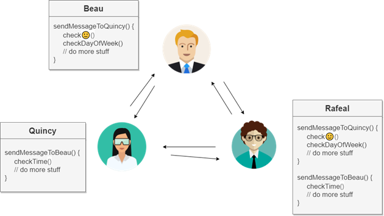

## **Problem**

### A scenario

Nowadays, thanks to the ChatRoom application, we can communicate online. When Beau and Quincy participate in the ChatRoom, they can send messages directly to all the participants or send to a specific participant in the group.

Imagine if Beau and Quincy want to add some rules about receiving messages:
- Beau does not want to receive any messages in the afternoon, because he relaxes during that time.

- Beside that, Quincy does not want to receive any messages on the weekend. On top of that, she also hates messages with contents containing 🙂 icon.

<!--  -->

### ChatRoom's dilemma 

- It is getting really hard to keep track of which rules reside in which objects, and how the various objects should relate to each other. 
  
- When an object wants to be edited or added some rules, we must each source code of each remaining object.

 
 

<!-- [Next chapter](./P01_Introduction.md "Introduction") -->
<!-- [
Next chapter
][./P01_Introduction.md "Introduction"] -->
<!-- [
Next chapter
](./P01_Introduction.md "Introduction") -->
