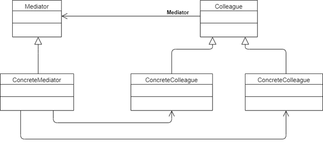

## Structure

<br/>

[](#)

<br/>

- ```Mediator``` - defines the interface for communication between *Colleague* objects.

- ```ConcreteMediator``` -  implements the Mediator interface and coordinates communication between *Colleague* objects. It is aware of all of the *Colleagues* and their purposes with regards to inter-communication.

- ```Colleague``` - defines the interface for communication with other *Colleagues* through its *Mediator*.

- ```ConcreteColleague``` - implements the Colleague interface and communicates with other *Colleagues* through its *Mediator*.

<br/>
<br/>

[](./P01_Introduction.md "Introduction")
[](./P03_Implementation.md "Implementation")