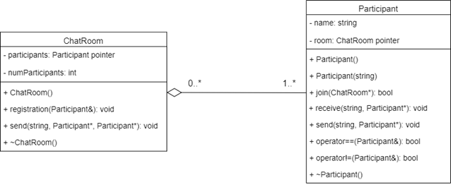

## Implementation

<br/>



<br/>

### Joining Chat Room

- Objects of ```Participant``` class send a request to join a chat room with name ```room``` through the ```join``` method.


- The request will be processed by the ```registration``` method of ```ChatRoom``` class.

```c++
bool Participant::join(ChatRoom* room)
{
  if (!room)
    return false;

  this->room = room;
  room->registration(*this);
  return true;
}
```
  
<br/>

- For simplicity, The room will not have any requirements for participants.

```c++
void ChatRoom::registration(Participant& participant)
{
  participants[numParticipants] = participant;
  numParticipants++;
}

```

<br/>

### Sending and receiving messages


- Participant send messages with content ```message``` to other participants through the ```send``` method.

- When sending messages, if the sender does not specify a receiver, the messages will be sent to all participants.

- The messages are not sent directly to the receivers, the object of ```ChatRoom``` class will deliver these messages.

```c++
void Participant::send(string message, Participant* to = NULL)
{
  if (to && *this == *to)
  {
    cout << "Self sending!" << endl;
    return;
  }
  room->send(message, this, to);
}
```
<br/>

- The ```send``` method of ```ChatRoom``` class is a middleman between the senders and the receivers. The messages will be delivered (and processed as needed) to the receivers here.

```c++
void ChatRoom::send(string message, Participant* from, Participant* to = NULL)
{
  if (to)
  {
    for (int i = 0; i < numParticipants; i++)
      if (participants[i] == *to)
      {
        participants[i].receive(message, from);
        return;
      }
    cout << "This one is not in the room!" << endl;
  }

  else
    for (int i = 0; i < numParticipants; i++)
      if (participants[i] != *from)
        participants[i].receive(message, from);
}
```

<br/>

- Receiving messages is the simplest method. The ```receive``` method of ```Participant``` class only has to print name of the sender and content of the messages.

```c++
void Participant::receive(string message, Participant* from)
{
  cout << from->name << " to " << name << ": " << message << endl;
}
```

<br/>
<br/>

[](./P02_Structure.md "Structure")
[](./P04_Pros_and_Cons.md "Pros and Cons")
