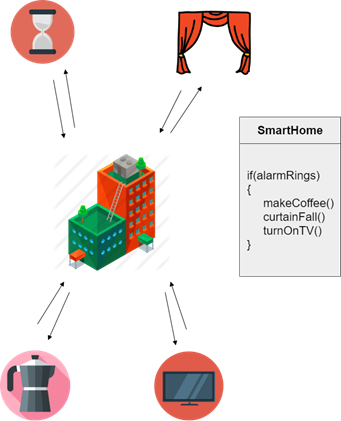

## Some real-world applications

### Smart home

- A smart home includes all kinds of smart devices such as: alarm clock, coffee machine, TV or curtain.

- When the host wants to watch TV, all of the devices can work together, automatic preparation for watching TV. For example, the process is：When the alarm rings -> The coffee machine starts making coffee -> The curtains fall automatically -> The TV is on.

- Solution: ```SmartHome``` class is the Mediator; ```Alarm```, ```CoffeePot```, ```Curtain``` and ```TV``` class is the Colleagues. When the alarm rings, ```SmartHome``` object will ask to work.

<br/>



<br/>

### Airport traffic control system


- Similar to the ChatRoom problem, a tower called *ATC* handles what planes can take off or land because all the communications are done from the planes to the control tower.
  
<br/>


<br/>

- The planes do not communicate with each other, they all communicate to the control tower and the control tower communicates back to the planes.

- In this case, *the ATC is the Mediator* and *the planes is the Colleagues*.

<br/>
<br/>

[](./P04_Pros_and_Cons.md "Pros and Cons")
[](# "Back to Home")